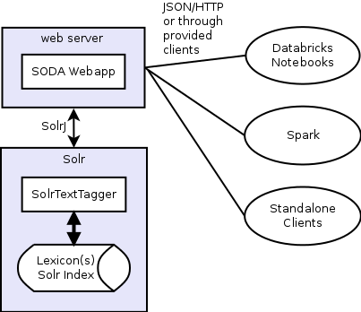

##Solr Dictionary Annotator

###Introduction

The Solr Dictionary Annotator (SoDA) is a Dictionary-based Annotator (or Gazetteer) that supports exact as well as fuzzy lookups across multiple lexicons.

SoDA is backed by a Solr index into which entity names (and synonyms) are entered, as well as the identifier for that entity. Fast (FST based) span lookup is done using the [SolrTextTagger](https://github.com/OpenSextant/SolrTextTagger) project. Additional fuzzy lookup features are supported using [OpenNLP](https://opennlp.apache.org/) and a mix of various normalization strategies.

###Usage

SoDA provides a JSON over HTTP interface. Requests are submitted to SoDA as JSON documents over HTTP POST, and SoDA responds with JSON documents. This form of API allows us to be language agnostic and cross platform. SoDA can be accessed from individual clients, Spark standalone applications and the [Databricks Notebook](https://databricks.com/product/databricks-cloud) environment using Python and Scala. Details of SoDA's [REST API](docs/api.md) can be found here.

###Architecture

In terms of architecture, the SoDA system looks something like this. 

Callers invoke the annotate (TBD) function with the necessary parameters, which results in a JSON/HTTP call to the SoDA webapp. Some calls, such as exact and lowercase lookup are passed directly to the SolrTextTagger. Other calls such as punctuation normalized lookup or unordered or fuzzy lookups, need the input string to be tokenized and the appropriate query made to Solr instead. For example, punctuation normalized lookups would require sentence normalization to ensure we don't match across sentence boundaries, and unordered or fuzzy lookups will require extracting phrases and matching.

###More Information

* [SoDA Installation and Configuration](docs/installation.md)
* [SoDA Application Programming Interface (API)](docs/api.md) 

