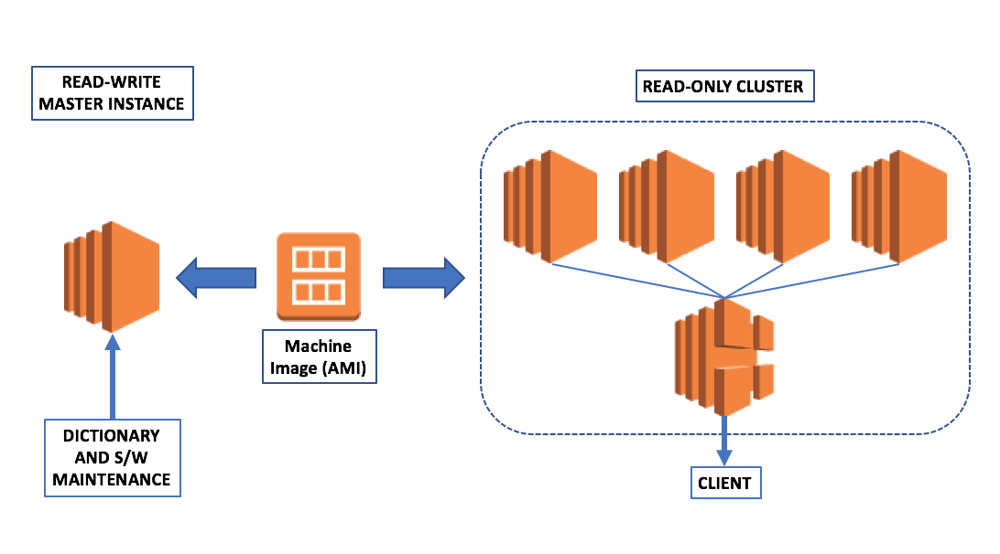

## SoDA Installation and Configuration

### Table of Contents

- [Hardware and OS](#hardware-and-os)
- [Databricks Environment](#databricks-environment)
- [Software Installation](#software-installation)
  - [Install Base Software](#install-base-software)
  - [Build SolrTextTagger](#build-solrtexttagger)
  - [Install and Configure SoDA](#install-and-configure-soda)
  - [Install and Configure Solr](#install-and-configure-solr)
  - [Install web server container](#install-web-server-container)
  - [Deploy SoDA WAR file](#deploy-soda-war-file)
  - [Verify Installation](#verify-installation)
- [Deployment](#deployment)
  - [Automatic Startup and Shutdown](#automatic-startup-and-shutdown)
  - [Building an AMI (AWS)](#building-an-ami-aws)
  - [AMI Maintenance (AWS)](#ami-maintenance-aws)
  - [Spinning up Read-only Clusters (AWS)](#spinning-up-read-only-clusters-aws)
- [Loading a Dictionary](#loading-a-dictionary)
- [Running SoDA local tests](#running-soda-local-tests)

----

This document lists out the steps needed to setup a SoDA server in the AWS cloud and visible to your Databricks cluster.

### Hardware and OS

The Hardware used for a single SoDA server box is a AWS EC2 m5.xlarge instance (16 GB RAM, 60 GB SSD, 4vCPU). Optionally, you can also select a different class of machine that has similar RAM and CPU, and attach EBS storage as described in [Making an Amazon EBS Volume Available for Use](http://docs.aws.amazon.com/AWSEC2/latest/UserGuide/ebs-using-volumes.html). We use Ubuntu Server 16.04, please make the necessary mental adjustments for other Linux flavors such as Amazon Linux.

The following ports need to be open on the server.

* port 22 (ssh)
* port 80 and 443 (http, https)
* port 8080 (soda)
* port 8983 (solr)

All software is installed under the home directory of user `ubuntu`. 

_**Optional: if you used an EBS volume for your storage**_

If you used an external EBS volume, you would link the mount point to a directory under the home directory and that would become your installation directory. For example:

    $ cd /mnt
    $ mkdir ebs
    $ sudo chown -R ubuntu:ubuntu ebs
    $ cd
    $ ln -s /mnt/ebs .
    $ cd ebs

----

### Databricks Environment

_**This is optional, if you use Databricks notebooks to access SoDA for annotations.**_

The server needs to be accessible from within the Databricks notebook environment, so it is required to have a "private" IP address that is visible to the Databricks cluster. In addition, for maintenance work on the server, it has a "public" IP address into which one can ssh in with a PEM file.

----

### Software Installation

We will need to SSH into the SoDA AWS box using its public IP (or private IP in case you use a VPC). You can log into the newly provisioned box as follows:

    laptop$ ssh -i /path/to/your/pem/file ubuntu@public_or_private_ip

#### Install Base Software

Once logged in, install git (to download various softwares from github), Java 8, latest maven (to build SolrTextTagger), Scala and sbt (to build soda).

Install git, used to download various softwares (SoDA and SolrTextTagger) from github.

    $ sudo apt-get update
    $ sudo apt-get install git-core

Install the Oracle 8 JDK. The JDK provides the JVM which will run Solr as well as the webserver that SoDA will run inside of. In addition, the Scala compiler and runtime will also depend on the JDK. Here are the sequence of commands you want to do this. More detailed [instructions from DigitalOcean](https://www.digitalocean.com/community/tutorials/how-to-install-java-with-apt-get-on-ubuntu-16-04) are available here. 

    $ sudo add-apt-repository ppa:webupd8team/java
    $ sudo apt-get update
    $ sudo apt-get install oracle-java8-installer
    $ sudo update-alternatives --config java  # select openjdk if not selected

Finally, set the `JAVA\_HOME="/usr/lib/jvm/java-8-oracle"` in your ${HOME}/.profile file and source it.

Install maven using the following commands. Maven will be used to build SolrTextTagger.

    $ sudo apt-get install maven

Install Scala. The current version is 2.12.6, and will be used to compile the SoDA application. [Detailed instructions](https://gist.github.com/Frozenfire92/3627e38dc47ca581d6d024c14c1cf4a9) here.

    $ sudo apt-get remove scala-library scala
    $ sudo wget http://scala-lang.org/files/archive/scala-2.12.1.deb
    $ sudo dpkg -i scala-2.12.1.deb
    $ sudo apt-get update
    $ sudo apt-get install scala

Install SBT (Scala Build Tool). SBT is used to build the SoDA application. [Detaild instructions](https://gist.github.com/Frozenfire92/3627e38dc47ca581d6d024c14c1cf4a9) from the same web page as for Scala.

    $ echo "deb https://dl.bintray.com/sbt/debian /" | sudo tee -a /etc/apt/sources.list.d/sbt.list
    $ sudo apt-key adv --keyserver hkp://keyserver.ubuntu.com:80 --recv 2EE0EA64E40A89B84B2DF73499E82A75642AC823
    $ sudo apt-get update
    $ sudo apt-get install sbt

#### Build SolrTextTagger

Download SolrTextTagger and build it.

    $ git clone https://github.com/OpenSextant/SolrTextTagger.git
    $ cd SolrTextTagger
    $ mvn test
    $ mvn package

This will create a solr-text-tagger-2.6-SNAPSHOT.jar file in the project's target folder, which you will need to install into the Solr installation that we will set up next.

#### Install and Configure SoDA

Download SoDA.

    $ git clone https://github.com/elsevierlabs-os/soda.git
    $ cd soda

All SoDA configuration parameters are read from src/main/resources/soda.properties. If SoDA is co-located with Solr, then you can just copy the soda.properties.template to soda.properties, otherwise modify the values as needed.

    $ cd src/main/resources
    $ cp soda.properties.template soda.properties
    $ cd -

Build SoDA. The build artifacts can be found in the target/scala-2.12 folder. The WAR file soda\_2.12-2.0.war is for the SoDA server, and the JAR file soda\_2.12-2.0.jar can be used if you want to incorporate the Scala SoDA client inside your application.

    $ sbt package

#### Install and Configure Solr 

Install Apache Solr. The latest version at the time of release was Solr 7.7.2.

    $ curl -O http://apache.mirrors.pair.com/lucene/solr/7.7.2/solr-7.7.2.tgz
    $ tar xvzf solr-7.7.2.tar.gz
    $ cd solr-7.7.2
    $ export SODA_HOME=`pwd`

Install the SolrTextTagger SNAPSHOT JAR file into Solr's lib directory.

    $ mkdir -p server/solr/lib
    $ cp ../SolrTextTagger/target/solr-text-tagger-2.6-SNAPSHOT.jar server/solr/lib

Increase the Solr JVM heap size from the default to a more generous 4 GB.

    $ vim bin/solr.in.sh
    SOLR_JAVA_MEM="-Xms4096m -Xmx4096m"

Start the Solr server.

    $ bin/solr start

Create the sodaindex core. (Note: in order to remove the core, replace create with delete in the command below).

    $ bin/solr create -c sodaindex

Create the schema for the sodaindex core. This uses the Solr JSON API to set up the field type needed by SolrTextTagger and the fields that SoDA needs to store the dictionary entries in various stages of stemming. If Solr is going to be co-located on the same box as SoDA, then you can just run the schema.sh command packaged with the SoDA source. Otherwise, modify the hostname in the curl command.

    $ ${SODA_HOME}/src/main/scripts/update_schema.sh

Add the SolrTextTagger handler to the Solr configuration. As with the schema, we can use the Solr JSON API to do this with a curl command. No changes are needed if Solr and SoDA are colocated on the same machine, otherwise the hostname needs to be changed.

    $ ${SODA_HOME}/src/main/scripts/update_solrconfig.sh

Restart Solr to allow the schema and configuration changes to take effect.

    $ bin/solr restart

#### Install web server container

We can use either Apache Tomcat or Jetty as our web container. SoDA v.2 has been tested using Apache Tomcat 8.5.32 and Jetty 9.4.11.v20180605.

To download and expand Tomcat, run these commands:

    $ wget http://download.nextag.com/apache/tomcat/tomcat-8/v8.5.32/bin/apache-tomcat-8.5.32.tar.gz
    $ tar xvzf apache-tomcat-8.5.32.tar.gz

To download and expand Jetty, run these commands:

    $ wget https://repo1.maven.org/maven2/org/eclipse/jetty/jetty-distribution/9.4.11.v20180605/jetty-distribution-9.4.11.v20180605.tar.gz
    $ tar xvzf jetty-distribution-9.4.11.v20180605.tar.gz

Deploy the WAR file `target/scala-2.12/soda_2.12-2.0.war` generated earlier using `sbt package`, to the container webapps directory as `soda.war`.

    $ cp target/scala-2.12/soda_2.12-2.0.war ${TOMCAT_HOME}/webapps/soda.war  # for tomcat
    $ cp target/scala-2.12/soda_2.12-2.0.war ${JETTY_HOME}/webapps/soda.war  # for jetty

Restart the container.

    $ cd ${TOMCAT_HOME}; bin/shutdown.sh; bin/startup.sh  # for tomcat
    $ cd ${JETTY_HOME}; bin/jetty.sh stop; bin/jetty.sh start  # for jetty

#### Verify Installation

You should be able to hit the SoDA index page at `http://public_ip:8080/soda/index.json`, and it should return a JSON response saying "status": "ok" and the Solr version being used in the backend.

----

### Deployment

#### Automatic Startup and Shutdown

We leverage the Linux service management daemon systemd to automatically start and stop Solr and the SoDA container services after and before the server shuts down respectively. Support for systemd is available on Ubuntu 16.04 (the OS used in this guide), as well as AWS Linux, RHEL Centos 7.x and above, Debian 8 and above, Fedora, etc. The service makes assumptions about the location of the custom start and stop scripts (under `${SODA_HOME}/src/main/scripts`), the locations of the Solr installation (`${HOME}/solr-${version}`) and the web container (`${HOME}/apache-tomcat-${version}` or `${HOME}/jetty-distribution-${version}`), as well as the username (`ubuntu`) running the scripts. These values are baked inside the service description `soda.services` and the start and stop scripts `start_app.sh` and `stop_app.sh`, all under the `src/main/scripts` subdirectory. These assumptions are in line with the instructions so far, but it is likely that versions might have changed, so please make updates to these files as necessary for your installation.

Here are the sequence of commands that are needed to allow the services to be started up and shut down automatically. First (after checking the contents), we will deploy our service definition to where systemd expects to find it.

    $ cd ${SODA_HOME}/src/main/scripts
    $ sudo cp soda.service /etc/systemd/system/

Next we do a quick dry run to see if our scripts will run properly using systemd. This will call the `start_app.sh` script, which will first start Solr and then the SoDA web container (in my case Apache Tomcat). The output on the console should be whatever you expect to see when you run these start commands manually. Next we just run a `curl` command to verify that SoDA is accepting requests.

    $ sudo systemctl start soda
    $ curl http://localhost:8080/soda/index.json

Finally, we enable the service so it will run automatically whenever the server starts up, and stop the service with systemd, thereby also verifying that the `stop_app.sh` script, which stops the two services in reverse order, works as intended.

    $ sudo systemctl enable soda
    $ sudo systemctl stop soda

#### Building an AMI (AWS)

The motivation for this part of the deployment was that the SoDA service is not very frequently used, so it seemed like a waste of resources to keep it running constantly. Now that we are able to start and stop the services automatically, there is less chance of human error around this step, so it now became more practical to have it be be shut down by default and only available on demand.

The next step along this evolutionary path was to replace the stopped server by a machine image (AMI). Because Amazon Web Services (AWS) is our cloud provider, the implementation below is AWS specific. However, the idea can probably be implemented with other cloud platforms as well. If you have done so and feel like sharing, please send me a link and I will include it here.

An AMI based workflow has a number of other advantages as well. For the dictionary and software maintainer, it acts as another "last known good configuration" checkpoint, similar to code commits. In addition, it allows different groups to start from the same AMI and diverge as needed. On the client side, the AMI approach allows easy cloning of multiple slaves. The two use cases (maintenance and usage) are shown in the diagram below, and the sections below describe scripts that can be used to achieve these use cases.

The very first AMI will need to be created manually. Once you have loaded up the software on an EC2 instance and implemented automatic startup and shutdown, use the AWS console to create an AMI of the current instance, following the [AWS Documentation for this](https://docs.aws.amazon.com/AWSEC2/latest/UserGuide/creating-an-ami-ebs.html). For convenience, I increased the size of my root partition to 60 GB rather than adding an EBS volume.

#### AMI Maintenance (AWS)

The first use case is that of dictionary and software maintenance. The requirement here is that you should be able to create an instance from your AMI, then make changes to the software or dictionary, and be able to generate a new AMI from the changes when you are happy with the changes you made. The `master_instance.py` script in the `src/main/scripts` folder is provided for this:

    $ python master_instance.py -h
    usage: master_instance.py [-h] [-c CONFIG] [-m COMMAND]
    
    Start or stop master SoDA instance
    
    optional arguments:
      -h, --help            show this help message and exit
      -c CONFIG, --config CONFIG
                            path to config file
      -m COMMAND, --command COMMAND
                            one of load|start|stop|save

Using this script, you can `start` or `stop` the master SoDA instance from the command line of your client machine. In addition, once you are happy with changes you have made and want to persist it into a new AMI, you can run the script with the `save` command, then rerun with the `load` command to restart with the new AMI.

You also have to specify configuration parameters specified within a configuration file as name-value (Java style) properties. In the `src/main/resources` directory, there is a `master_instance.properties.template` file that specifies the parameters that you need to provide. See the inline comments for more information. Please keep a copy of this file because the script computes configuration parameters as it runs and will overwrite the configuration file name provided (and remove the comments in the process).

    # The image ID and version for the first AMI you create manually
    # We start with 0, AMI name is SodaSolrV2-AMI-v${IMAGE_VERSION}
    # Note: this will get updated when you save a new AMI, so if you want to create a
    # cluster with this AMI, you need to manually copy over the updated value.
    IMAGE_ID=your-soda-ami-id
    IMAGE_VERSION=0
    # Instance type: m5.xlarge is a suggestion, choose per requirement.
    INSTANCE_TYPE=m5.xlarge
    # Path to your PEM file. During runtime, it will be temporarily copied to current dir
    KEY_FILE=/path/to/your/PEM/file
    # Subnet ID in which your AWS host will run
    SUBNET_ID=your-aws-subnet-id
    # Security groups for your AWS host
    SECURITY_GROUP_IDS=your-aws-security-group-id-1,your-aws-security-group-id-2,...
    # The private IP you want it assigned to. My setup is within a VPC, so having a standard
    # internal address is very helpful for all clients connecting to it
    PRIVATE_IP_ADDRESS=your-private-ip-address
    # The name and owner tags for the master EC2 box
    NAME_TAG=SodaSolrV2
    OWNER_TAG=your-email-address@your-company.com

#### Spinning up Read-only Clusters (AWS)

The second use case is to easily spin up large clusters without too much effort. In this mode, we are not interested in maintainining the dictionaries or updating the software, but rather using the service to annotate our text. Because each SoDA request is stateless, it is possible to scale SoDA out horizontally as shown in the diagram and achieve linear throughput gains. You can spin up a cluster by providing a configuration file and the number of workers in the cluster using the `cluster_instance.py` in the `src/main/scripts` folder as shown below.

    $ python cluster_instance.py -h
    usage: cluster_instance.py [-h] [-c CONFIG] [-n NUM_SLAVES] [-m COMMAND]
    
    Start or stop read-only SoDA cluster
    
    optional arguments:
      -h, --help            show this help message and exit
      -c CONFIG, --config CONFIG
                            path to config file
      -n NUM_SLAVES, --num_slaves NUM_SLAVES
                            number of SoDA slaves
      -m COMMAND, --command COMMAND
                            one of start|stop

Here the commands are `start` and `stop`, which will create the number of worker SoDA instances from the AMI and put it behind an AWS Application Load Balancer (ALB). The `---num_slaves` parameter specifies how many workers are needed for the cluster, and the configuration file specified by the `--config` parameter contains name-value pairs in Java properties file format. As with the previous script, the `src/main/resources` folder contains a template file `cluster_instance.properties.template` which is shown below. Please make a copy of this file before calling the command above because the file name provided via the `--config` parameter will be updated by the script and the comments will be removed.

    # The image ID for the SoDA AMI
    # Note that this needs to be manually updated from whatever it is in your
    # master_instance.properties file
    IMAGE_ID=your-soda-ami-id
    # Instance type for each worker machine. m5.xlarge is a suggestion, choose per requirement.
    INSTANCE_TYPE=m5.xlarge
    # Path to your PEM file. During runtime, it will be temporarily copied to current directory.
    KEY_FILE=/path/to/your/PEM/file
    # Subnet ID in which the cluster will run. Usually this is a private subnet.
    SUBNET_ID=your-aws-subnet-id
    # Security groups for the worker machines. Typically, worker machines will reside in private
    # subnets of your VPC, but the load balancer will be in a public subnet. Security groups 
    # must ensure access to your HTTP_PORT from the load balancer to the worker machines.
    SECURITY_GROUP_IDS=your-security-group-id-1,your-security-group-id-2,...
    # Load balancer properties
    # VPC_ID for VPC in which the Application Load Balancer (ALB) will run
    LB_VPC_ID=your-aws-vpc-id
    # Subnet IDs in which the the ALB will run. Must be at least 2.
    LB_SUBNET_IDS=your-public-subnet-id-1,your-public-subnet-id-2,...
    # Security groups for the ALB
    LB_SECURITY_GROUP_IDS=your-lb-security-group-id-1,your-lb-security-group-id-2,...
    # SoDA status URL, this will be used by ALB to healthcheck workers in cluster.
    LB_STATUS_URL=/soda/index.json
    # Name and owner tags for ALB and worker machines. The ALB will be given a Name tag
    # of ${NAME_TAG}-alb, and worker machines will be named ${NAME_TAG}-worker-{n}, where
    # n is a number starting with 1.
    NAME_TAG=SodaSolrV2
    OWNER_TAG=your-email-address@your-company.com
    # This was added because our AWS admin created security groups for HTTP ingress on 
    # port 80 while SoDA typically listens on port 8080. We needed to create some iptables
    # rules to forward port 80 to 8080, and we set the HTTP_PORT to 80 instead. If you
    # don't have this issue, just follow the instructions and keep the port set to 8080.
    HTTP_PORT=8080

----

### Loading a Dictionary

You can load a dictionary from a formatted tab-separated file using the SodaBulkLoader class provided with SoDA. Currently there is only a single main class, so SBT will not prompt for the class name to run. If prompted, choose the SodaBulkLoader class to run.

    $ sbt
    sbt> run ${lexicon_name} ${path_to_input_file} number_of_workers ${delete_lexicon}

Where the `lexicon_name` is the name of the dictionary the entries are to be loaded into, and the `path_to_input_file` represents the full path to the tab-separated data file. The `number_of_workers` value is the number of parallel workers that will be created to do the inserts and should be equal or less than the number of CPUs on the SoDA/Solr box. The `delete_lexicon` parameter can be set to either true or false, if true, it will first delete the named lexicon from the index before loading.

The file must have the following format:

    id {TAB} primary-name {PIPE} alt-name-1 {PIPE} ... {PIPE} alt-name-n

where {TAB} and {PIPE} represent the tab and pipe characters respectively.

The id field must be unique across lexicons. It is recommended that the id value be structured as a URI that incorporates the lexicon name in it.

If you prefer, there is also a script src/main/scripts/bulk\_load.sh which can be called as shown below. Note, however, that the classpath is based on a working sbt setup, with paths to JAR files pointing to the underlying ivy2 cache under the ${HOME} directory. If you have a different repository structure for your JAR files, you will very likely need to customize this script.

    $ cd src/main/scripts
    $ ./bulk_load.sh ${lexicon_name} ${path_to_input_file} ${num_workers} ${delete_lexicon}

----

### Running SoDA local tests

Scala tests can be run using SBT and Python sodaclient tests can be run using nose. Note that you need a running Solr instance and a SoDA instance for the tests to run successfully.

Bring up Solr if not already running.

    $ cd ${SOLR_HOME}
    $ bin/solr start

If SoDA is running inside a Tomcat or Jetty container, shut that down. The unit tests are designed to run against an embedded version of Jetty, where the application context is different from that in an external Tomcat or Jetty container.

    $ cd ${TOMCAT_HOME}; bin/shutdown.sh  # for Tomcat
    $ cd ${JETTY_HOME}; bin/jetty.sh stop  # for Jetty

Bring up SoDA in sbt using sbt's built-in Jetty server.

    $ cd ${SODA_HOME}
    $ sbt
    sbt> jetty:start

Run the Scala unit tests within sbt as follows (or on a different terminal using `sbt test`).

    sbt> test

Summary information about the number of tests being run and run successfully will be printed on the console. It is expected that all tests pass.

Next on a different terminal, navigate to the `src/main/python` subdirectory.

    $ cd ${SODA_HOME}/src/main/python
    $ nosetests sodaclient_test.py

Summary information about the number of tests being run and run successfully is printed on the console. As before, the expectation is that all tests pass.

Finally, you can turn off the built-in Jetty server and exit sbt.

    sbt> jetty:stop
    sbt> exit

Shut down Solr if not already shut down.

    $ cd ${SOLR_HOME}
    $ bin/solr stop

